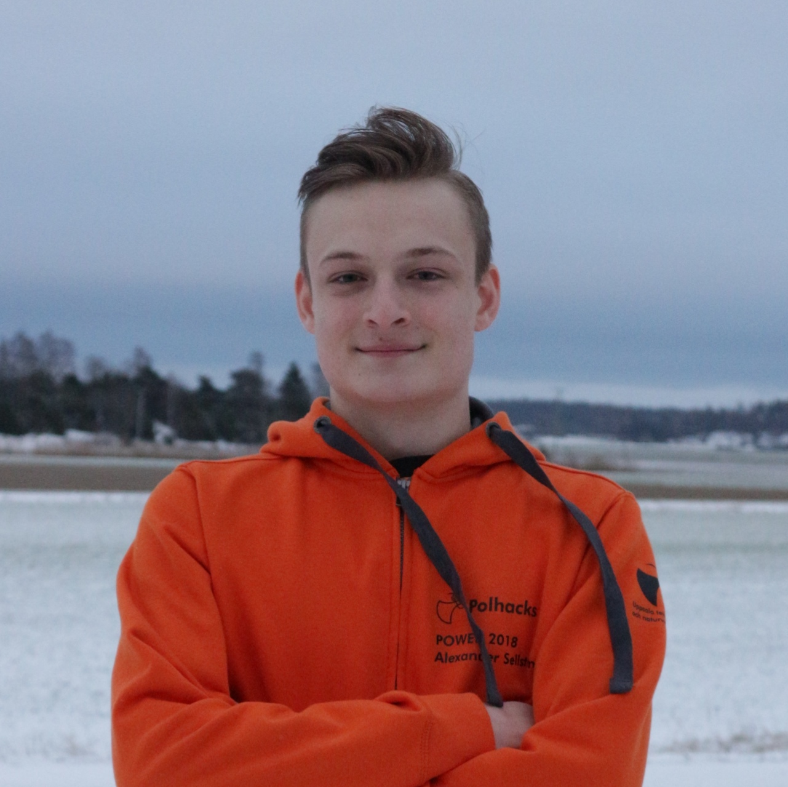
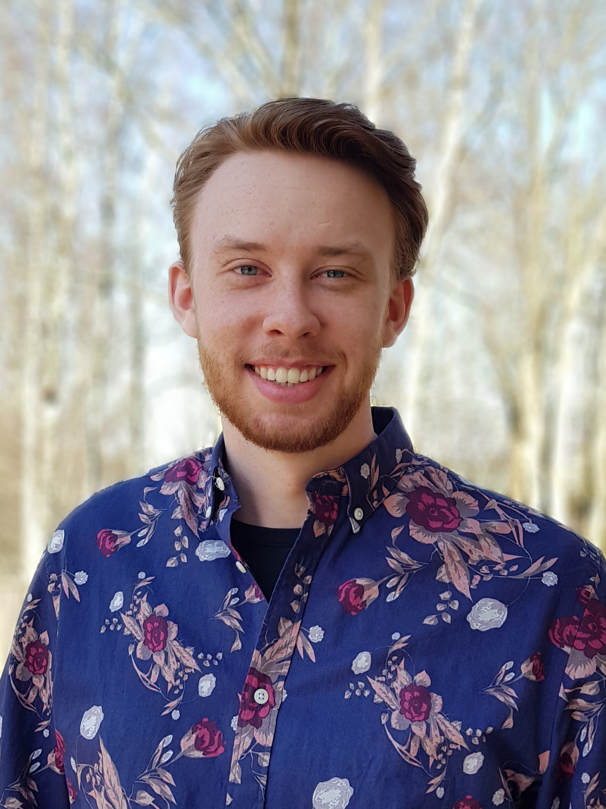
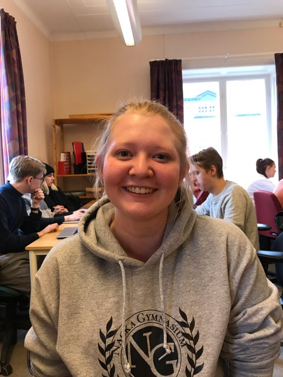
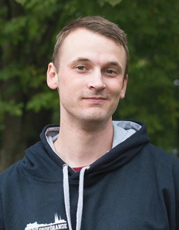
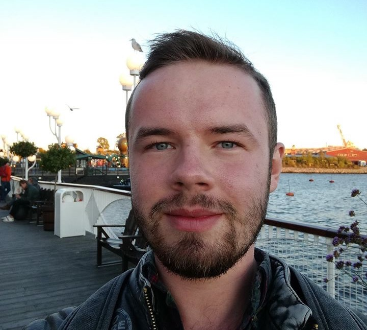

# Medlemmar Hallon

Projektarbete på kursen Datorsystem med projekt (1DT003) våren 2019, Uppsala universitet.

Bild | Förnamn | Efternamn | Personnummer | Användarnamn (GitHub)
-----------------------------------------|-----------------------------|-----------|--------------|----------------------
 | [Agnes](#Agnes-Abrahamsson) | Abrahamsson | 961002-2981 | `agnesabrahamsson`
 | [Alexander](#Alexander-Sellström) | Sellström | 980317-5950 | `rednaxela5950`
 | [Anton](#Anton-Nyström) | Nyström | 981012-7275 | `NystromAnton`
 | [Catya](#Catya-Kemppainen) | Kemppainen | 980714-3509 | `catya98`
 | [Markus](#Markus-Johnson) | Johnson | 931002-8635 | `Mk3Johnson`
 | [Nils](#Nils-Hedberg) | Hedberg | 960808-0033 | `nilshugo`

## Agnes Abrahamsson

### Okänd talang

På fritiden gillar jag att engagera mig för djurs rättigheter och laga vegansk mat :)

### Starka sidor

Under projektet tror jag att jag kommer ha lättast att bidra med:

- Samarbete
- Planering
- Dokumentation
- Muntlig presentation
- Rapportskrivande
- Bra stämning :)

### Personlig utveckling

Under projektet hoppas jag förutom att bli ännu bättre på mina redan starka
sidor även ges möjlighet att utveckla följande färdigheter:

- analys/design/specifikation
- problemlösning och algoritmer
- skriva kod utifrån färdig specifikation
- research (söka och sammanställa information)
- Jobba agilt
- Komma i tid

## Alexander Sellström

### Okänd talang

Jag gillar att mecka med och laga elektronik/datorer.

### Starka sidor

Under projektet tror jag att jag kommer ha lättast att bidra med:

- problemlösning och algoritmer
- planering
- research (söka och sammanställa information)
- rapportskrivande

### Personlig utveckling

Under projektet hoppas jag förutom att bli ännu bättre på mina redan starka
sidor även ges möjlighet att utveckla följande färdigheter, till exempel:

- skriva kod utifrån färdig specifikation
- samarbete
- ledarskap
- dokumentation
- muntlig presentation

## Anton Nyström

### Okänd talang

Jag brukar spela en del saxofon/gitarr

### Starka sidor

Under projektet tror jag att jag kommer ha lättast att bidra med:

- skriva kod utifrån färdig specifikation
- planering
- research (söka och sammanställa information)
- rapportskrivande

### Personlig utveckling

Under projektet hoppas jag förutom att bli ännu bättre på mina redan starka
sidor även ges möjlighet att utveckla följande färdigheter:

- analys/design/specifikation
- problemlösning och algoritmer
- dokumentation

## Catya Kemppainen

### Okänd talang

Något som jag verkligen gillar att göra på fritiden är att baka.

### Starka sidor

Under projektet tror jag att jag kommer ha lättast att bidra med:

- analys
- planering
- samarbete
- rapportskrivande
- muntlig presentation

### Personlig utveckling

Under projektet hoppas jag förutom att bli ännu bättre på mina redan starka
sidor även ges möjlighet att utveckla följande färdigheter, till exempel:

- analys/design/specifikation
- problemlösning och algoritmer
- skriva kod utifrån färdig specifikation
- research (söka och sammanställa information)
- dokumentation
- rapportskrivande
- arbeta självständigt

## Markus Johnson

### Okänd talang
Gillar att rita och spela musik. Har tidigare spelat basket

### Starka sidor
Under projektet tror jag att jag kommer ha lättast att bidra med:

- analys/design/specifikation
- problemlösning och algoritmer
- skriva kod utifrån färdig specifikation
- planering
- samarbete
- ledarskap
- research (söka och sammanställa information)
- dokumentation
- rapportskrivande
- utvärdering av praktisk genomförbarhet
- idé spruta

### Personlig utveckling
Under projektet hoppas jag förutom att bli ännu bättre på mina redan starka sidor även ges möjlighet att utveckla följande färdigheter, till exempel:

- problemlösning och algoritmer
- skriva kod utifrån färdig specifikation
- samarbete
- ledarskap
- arbetsfördelning och konflikt resolution

## Nils Hedberg

### Okänd talang

Gillar att lyssna på och spela musik. Jag sjunger och spelar gitarr.

### Starka sidor

Under projektet tror jag att jag kommer ha lättast att bidra med:

- analys/design/specifikation
- problemlösning och algoritmer
- skriva kod utifrån färdig specifikation
- ledarskap
- dokumentation
- muntlig presentation

### Personlig utveckling

Under projektet hoppas jag förutom att bli ännu bättre på mina redan starka
sidor även ges möjlighet att utveckla följande färdigheter, till exempel:

- planering
- samarbete
- ledarskap
- rapportskrivande
