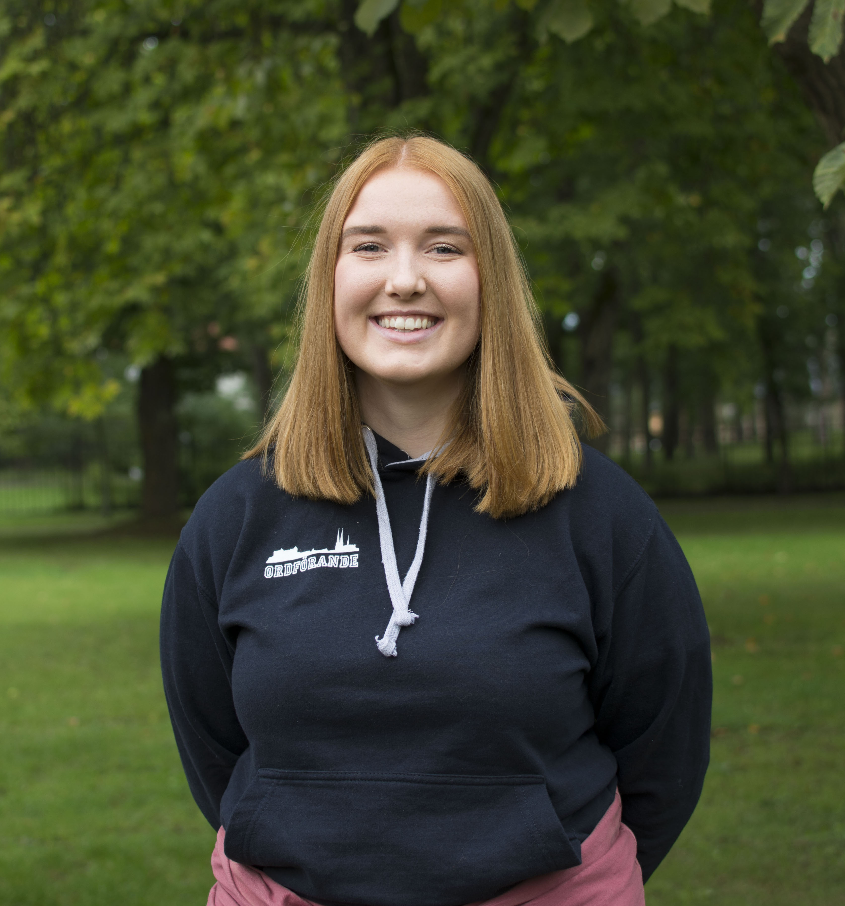

# Medlemmar Hallon

Projektarbete på kursen Datorsystem med projekt (1DT003) våren 2019, Uppsala universitet.

**INFO:** Detta dokument är skrivet i
formatet
[Markdown](https://help.github.com/articles/getting-started-with-writing-and-formatting-on-github/).

**INFO:** Det går att redigera, förhandsvisa och spara
(commit) [sidan](./gruppkontrakt.md) på GitHub direkt i din webbläsare.

**INFO:** För att lärarna på kursen skall kunna följa och bedöma era
arbetsinsatser är det viktigt att vi vet vem som är vem vid till exempel
muntliga presentationer och andra möten.

**TODO:** Tag foton av alla medlemmar i gruppen. Varje foto skall tydligt visa
 personen framifrån från axlarna och uppåt. Spara bilderna i mappen
 `meta/images/`. Fyll sedan i tabellen nedan. Tabellen skall vara sorterad på
 förnamn. Fältet **Förnamn** skall länka till avsnittet med mer detaljer för
 respektive medlem. I tabellen skall alla bilder ha samma bredd.

**INFO:** För sådant som inte går att uttrycka med den variant av Markdown som
GitHub använder går det bra att använda HTML istället. Till exempel går det att
använda en `` tag för att sätta bredden på en bild
till `180` pixlar.

**INFO:** Om ni inte vill bråka med syntaxen för tabeller i Markdown går det bra
 att byta ut hela tabellen mot en HTML-tabell.

**INFO:** För att länka till en rubrik på formen `En rubrik med åäö` använd
ankaret `#en-rubrik-med-åäö`.

Bild | Förnamn | Efternamn | Personnummer | Användarnamn (GitHub)
-----------------------------------------|-----------------------------|-----------|--------------|----------------------
 | [Agnes](#Agnes-Abrahamsson) | Abrahamsson | YYMMDD-XXXX | `anders877`
 | [Alexander](#Alexander-Sellström) | Sellström | YYMMDD-XXXX | `anders877`
 | [Anton](#Anton-Nyström) | Nyström | YYMMDD-XXXX | `anders877`
 | [Catya](#Catya-Kemppainen) | Kemppainen | YYMMDD-XXXX | `anders877`
 | [Markus](#Markus-Johnson) | Johnson | 931002-8635 | `Mk3Johnson`
 | [Nils](#Nils-Hedberg) | Hedberg | YYMMDD-XXXX | `anders877`

**TODO:** Utgå från mallen nedan och skapa ett avsnitt för varje medlem i
gruppen sorterade i bokstavsordning.

## Agnes Abrahamsson

### Okänd talang

**TODO:** Beskriv kortfattad något du gillar att göra vid sidan av dina studier.

### Starka sidor

Under projektet tror jag att jag kommer ha lättast att bidra med:

**TODO:** Skapa en lista med kortfattad beskrivning över områden där du tror du
 har lättast att bidra till projektet, till exempel:

- analys/design/specifikation
- problemlösning och algoritmer
- skriva kod utifrån färdig specifikation
- planering
- samarbete
- ledarskap
- research (söka och sammanställa information)
- dokumentation
- rapportskrivande
- muntlig presentation
- lägg gärna till flera punkter ...

### Personlig utveckling

Under projektet hoppas jag förutom att bli ännu bättre på mina redan starka
sidor även ges möjlighet att utveckla följande färdigheter, till exempel:

**TODO:** Skapa en lista, till exempel:

- analys/design/specifikation
- problemlösning och algoritmer
- skriva kod utifrån färdig specifikation
- planering
- samarbete
- ledarskap
- research (söka och sammanställa information)
- dokumentation
- rapportskrivande
- muntlig presentation
- lägg gärna till flera punkter ...

## Alexander Sellström

### Okänd talang

**TODO:** Beskriv kortfattad något du gillar att göra vid sidan av dina studier.

### Starka sidor

Under projektet tror jag att jag kommer ha lättast att bidra med:

**TODO:** Skapa en lista med kortfattad beskrivning över områden där du tror du
 har lättast att bidra till projektet, till exempel:

- analys/design/specifikation
- problemlösning och algoritmer
- skriva kod utifrån färdig specifikation
- planering
- samarbete
- ledarskap
- research (söka och sammanställa information)
- dokumentation
- rapportskrivande
- muntlig presentation
- lägg gärna till flera punkter ...

### Personlig utveckling

Under projektet hoppas jag förutom att bli ännu bättre på mina redan starka
sidor även ges möjlighet att utveckla följande färdigheter, till exempel:

**TODO:** Skapa en lista, till exempel:

- analys/design/specifikation
- problemlösning och algoritmer
- skriva kod utifrån färdig specifikation
- planering
- samarbete
- ledarskap
- research (söka och sammanställa information)
- dokumentation
- rapportskrivande
- muntlig presentation
- lägg gärna till flera punkter ...

## Anton Nyström

### Okänd talang

**TODO:** Beskriv kortfattad något du gillar att göra vid sidan av dina studier.

### Starka sidor

Under projektet tror jag att jag kommer ha lättast att bidra med:

**TODO:** Skapa en lista med kortfattad beskrivning över områden där du tror du
 har lättast att bidra till projektet, till exempel:

- analys/design/specifikation
- problemlösning och algoritmer
- skriva kod utifrån färdig specifikation
- planering
- samarbete
- ledarskap
- research (söka och sammanställa information)
- dokumentation
- rapportskrivande
- muntlig presentation
- lägg gärna till flera punkter ...

### Personlig utveckling

Under projektet hoppas jag förutom att bli ännu bättre på mina redan starka
sidor även ges möjlighet att utveckla följande färdigheter, till exempel:

**TODO:** Skapa en lista, till exempel:

- analys/design/specifikation
- problemlösning och algoritmer
- skriva kod utifrån färdig specifikation
- planering
- samarbete
- ledarskap
- research (söka och sammanställa information)
- dokumentation
- rapportskrivande
- muntlig presentation
- lägg gärna till flera punkter ...

## Catya Kemppainen

### Okänd talang

**TODO:** Beskriv kortfattad något du gillar att göra vid sidan av dina studier.

### Starka sidor

Under projektet tror jag att jag kommer ha lättast att bidra med:

**TODO:** Skapa en lista med kortfattad beskrivning över områden där du tror du
 har lättast att bidra till projektet, till exempel:

- analys/design/specifikation
- problemlösning och algoritmer
- skriva kod utifrån färdig specifikation
- planering
- samarbete
- ledarskap
- research (söka och sammanställa information)
- dokumentation
- rapportskrivande
- muntlig presentation
- lägg gärna till flera punkter ...

### Personlig utveckling

Under projektet hoppas jag förutom att bli ännu bättre på mina redan starka
sidor även ges möjlighet att utveckla följande färdigheter, till exempel:

**TODO:** Skapa en lista, till exempel:

- analys/design/specifikation
- problemlösning och algoritmer
- skriva kod utifrån färdig specifikation
- planering
- samarbete
- ledarskap
- research (söka och sammanställa information)
- dokumentation
- rapportskrivande
- muntlig presentation
- lägg gärna till flera punkter ...

## Markus Johnson

### Okänd talang

**TODO:** Beskriv kortfattad något du gillar att göra vid sidan av dina studier.

### Starka sidor

Under projektet tror jag att jag kommer ha lättast att bidra med:

**TODO:** Skapa en lista med kortfattad beskrivning över områden där du tror du
 har lättast att bidra till projektet, till exempel:

- analys/design/specifikation
- problemlösning och algoritmer
- skriva kod utifrån färdig specifikation
- planering
- samarbete
- ledarskap
- research (söka och sammanställa information)
- dokumentation
- rapportskrivande
- muntlig presentation
- lägg gärna till flera punkter ...

### Personlig utveckling

Under projektet hoppas jag förutom att bli ännu bättre på mina redan starka
sidor även ges möjlighet att utveckla följande färdigheter, till exempel:

**TODO:** Skapa en lista, till exempel:

- analys/design/specifikation
- problemlösning och algoritmer
- skriva kod utifrån färdig specifikation
- planering
- samarbete
- ledarskap
- research (söka och sammanställa information)
- dokumentation
- rapportskrivande
- muntlig presentation
- lägg gärna till flera punkter ...

## Nils Hedberg

### Okänd talang

**TODO:** Beskriv kortfattad något du gillar att göra vid sidan av dina studier.

### Starka sidor

Under projektet tror jag att jag kommer ha lättast att bidra med:

**TODO:** Skapa en lista med kortfattad beskrivning över områden där du tror du
 har lättast att bidra till projektet, till exempel:

- analys/design/specifikation
- problemlösning och algoritmer
- skriva kod utifrån färdig specifikation
- planering
- samarbete
- ledarskap
- research (söka och sammanställa information)
- dokumentation
- rapportskrivande
- muntlig presentation
- lägg gärna till flera punkter ...

### Personlig utveckling

Under projektet hoppas jag förutom att bli ännu bättre på mina redan starka
sidor även ges möjlighet att utveckla följande färdigheter, till exempel:

**TODO:** Skapa en lista, till exempel:

- analys/design/specifikation
- problemlösning och algoritmer
- skriva kod utifrån färdig specifikation
- planering
- samarbete
- ledarskap
- research (söka och sammanställa information)
- dokumentation
- rapportskrivande
- muntlig presentation
- lägg gärna till flera punkter ...

## Färdigställ

- Tag bort alla stycken markerade med **TODO** och **INFO**.
- Tag bort avsnittet Anders Andersson.
- Tag bort hela detta avsnitt, dvs tag bort avsnittet **Färdigställ**.
